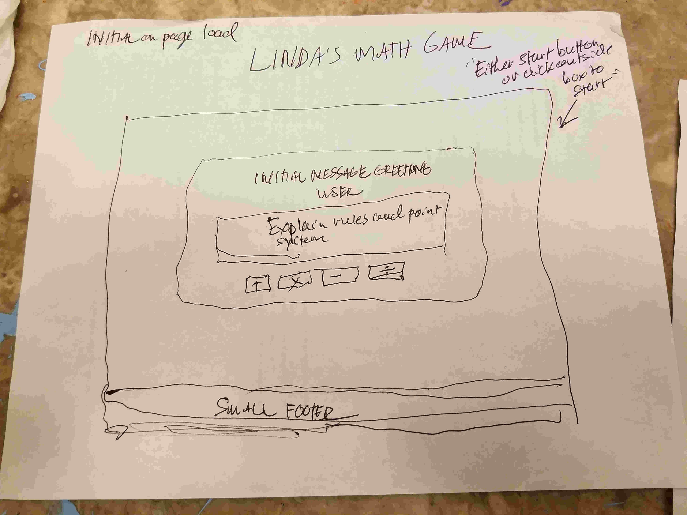
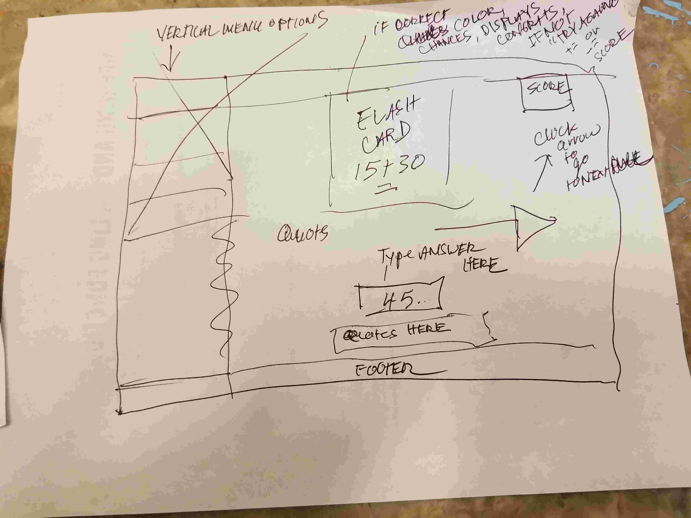

# Linda's Math Game

This is a math game for second / third graders. It uses a flashcard type system with an interface that ( hopefullly ) engages learning.

[Click Here to Play  :)](https://papadavis47.github.io/lindas-math-game/.)

## Tech Used

* HTML5 & CSS
* JavaScript

# Mad Scientist Initial Wire Frames

## Initial Screen

## Initial Game Concept

## My MVP

The user will be able to choose whether to play with addition, subtraction, multiplication or division. Each one of these choices will have ten different math problems on "flashcards".

There will be a large message in the beginning that greets the user and there will be button or checkboxes to choose which type of math problem.

The user will have a button to "start". On hover of the mouse over the start button - you will hear Linda Davis' voice saying: "You should do a math game." Then the user will see the first problem.

The game will display math problems and the user will type in the answer *(number)* of the problem displayed on the flash card. The entire page will be responsive to different window sizes.

There will be different sound depending on whether the user types in a correct answer.

There will be a point system *( maybe 5 points per question)* where the user can earn 5 points per correct answer and will decrement 5 points per wrong answer. Once a certain number of points are earned *( maybe 50 points )* the user will win.

There is no "lose" condition - only communicating to the user if their answer is incorrect. 

# My Process
I began with the initial ideas for the visual structure of the game and I consulted with my own children for what they liked in a learning game. 

One of my initial ideas was to have sound, so over the weekend after project start I began recording voice over and building the HTML structure of the various transitions in the game. It was the first time I had worked on a single page that hides and shows content using javascript event listeners. 

The first draft of my CSS styling began on Sunday. On Monday I continued to work on CSS and I began to build the javascript in small pieces in order to test out sound and transitions. On Tuesday and Wednesday I began coding the logic flow of the game. I recieved help from my instructors in how to do so. They showed me the importance of writing pseudo code much more specifically than I had been doing previously. 

After learning some more things about DOM manipulation and structuring code - I began to put the pieces together and slowly complete the javascript process.

I have learned a ton through this entire process.

## Stretch Goals

* To make the entire game bilingual *( english / spanish )*.

* Include sound recording of Linda Davis' voice - reading each math problem - which the user will hear, in addition to seeing the numbers on the screen and the rest of the visual interface.

* Incorporate short, inspirational quotes from various female mathematicians and computer scientists, programmers, venture capitalists - whatever I can find.

* Increase the number of math problems per "choice", multiplication, division, etc.

* After the user types in the answer it will either display that the answer was correct or incorrect - then it will ask if they want to see the answer to the question. They can choose to see the answer or not.

* Find a way to work with an API of some kind - in some way

* Make a mobile version

# External Sources

* [Google Fonts](https://fonts.google.com/)
* [Font Awesome](https://fontawesome.com/)
* [Stack Overflow](https://stackoverflow.com/)
* [Treehouse](https://www.teamtreehouse.com)
* [FlatUI Colors](https://flatuicolors.com/)

 

